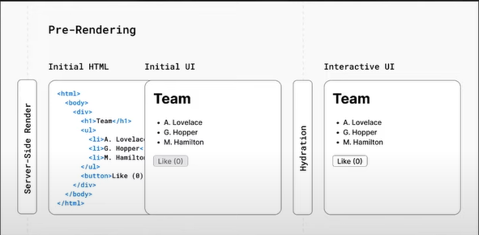

# Client Side Rendering
Client Side Rendering adalah salah satu konsep dari Pre-Rendering yang ada di dalam NEXT JS.

## Pre Rendering
Pengambilan data eksternal dan transformasi kode menjadi representasi HTML dari sebuah UI terjadi sebelum hasilnya dikirim ke Client

HTML akan di generate kemudian HTML, data, dan Javascript dikirim ke Client.

HTML digunakan untuk menampilkan halaman tapi belum interaktif, sedangkan React akan melakukan proses `hydration` dengan menggunakan data dan Javascript untuk membuat komponen menjadi interaktif.

## Server Side Rendering
HTML akan di generate kemudian HTML, data dan Javascript dikirim ke Client yang dilakukan saat `run time`.

## Static Site Generation
HTML akan di generate di Server namun hanya di generate sekali saat `build time`. Sehingga content yang ditampilkan bersifat statis.

## Dokumentasi
`getServerSideProps()` adalah fungsi dari Next JS untuk melakukan server side rendering. 
Dipanggil setiap melakukan request

## Perbedaan Client Side dan Server Side
1. Pada sisi client, terdapat skeleton sedangkan server side tidak ada 

- Pada saat kita buat fetching data melalui server side maka dia tidak akan memunculkan skeleton

- hal ini bisa kita coba ketika mangakses url : 
    http://localhost:3000/product/server
- Namun apabila kita menggunakan url :
    http://localhost:3000/product

maka akan muncul skeleton beberapa detik, sebelum data nya diterima.

2. Dari sisi Client, saat kita cek `network` itu ada request ke API yang dituju sedangkan pada saat server side, tidak ada api yg dituju

3. Dari sisi Client, ketika kita cek bagian dokumen-response nya, itu terlihat bahwa baru ada skeleton nya
sedangkan kalau kita cek yang server side, dia sudah menampilkan seluruh data nya pada bagian response nya.

Jadi artinya, yang server side, halaman nya sudah siap ketika sudah bisa di load oleh browser. 

Sementara client side, dia harus me-load dulu data nya baru ditampilkan, sehingga muncul skeleton.